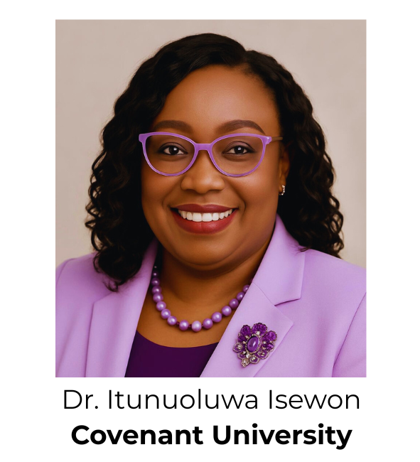

# ACEMFS FUT Minna Bioinformatics Workshop

# Workshop Title: Bioinformatics Training

The **African Center of Ecellence for Mycotoins and Food Safety (ACEMFS)** was stablished in 2019, through Africa Center of Ecellence Award, and co-sponsored by the Association of African Universities, the world bank, AFD and supported by the National Universities Commission of Nigeria. The main objective of the center is to produce a skilled workforce with quality training in the use of modern functional equipment and innovative research to assess the impacts of food pathogens and toxic chemical residues on the health and economy of the West and Central African sub-region. ACEMFS thus aims to contribute to the effective prevention and control of food poisoning, which can guide policy formulation throughout the African region. The center has expertise in parasitology, mycotoxicology, food science and nutrition.

******
## Trainer

## Teaching Assistants

******
## Workshop Overview
### Workshop Timetable

### Day 1 Plan: Genomics & Sequence Analysis
|**Time**|**Session**|**Details**|
|:---:|:---:|:---:|
9:00 AM - 9:30 AM| **Welcome & Overview**| Workshop objectives, introduction to bioinformatics, relevance to mycotoxin research
9:30 AM - 10:30 AM| **Introduction to Biological Databases**| NCBI, ENA, UniProt, PDB, Ensembl, KEGG - how to search, download, and interpret
10:30 AM - 11:00 AM| Break
11:00 AM - 12:30 AM| **Sequence Retrieval & Quality Control (Galaxy)**| Tool: FastQC; Dataset: Mycotoxin-related fungal genome from ENA
12:30 PM - 1:30 PM| Lunch
1:30 PM - 3:00 PM| **Sequence Alignment & BLAST**| Tool: BLAST (via Galaxy); Task: Homology search for mycotoxin biosynthesis genes
3:00 PM - 4:30 PM| **Primer Design for Gene Targeting**| Tool: Primer3(via Galaxy or Primer-BLAST); Task: Design primers for a conserved gene

### Day 2 Plan: Phylogeny, Biostatistics & Transcriptomics
|**Time**|**Session**|**Details**|
|:---:|:---:|:---:|
9:00 AM - 10:30 AM| **Phylogenic Tree Construction**|Tool: Clustal Omega, MEGA
10:30 AM - 11:00 AM| Break
11:00 AM - 12:30 PM| **Biostatistics in R for Omics Data**| Tool: RStudio (cloud or local); Task: Volcano plots, boxplots, PCA
12:30 PM - 1:30 PM| Lunch
1:30 PM - 3:00 PM| **Transcriptomic Data Analysis: RNA-Seq**| Tools: Galaxy RNA-Seq workflow - HISAT2, featureCounts
3:00 PM - 4:30 PM| **Differential Expression Analysis in Galaxy**| Tool: DESeq2; Task: Fold change and volcano plots using example dataset (e.g., stress response in Aspergillus)

### Day 3 Plan: Structural Bioinformatics
|**Time**|**Session**|**Details**|
|:---:|:---:|:---:|
9:00 AM - 10:30 AM| **Recap of day 1 and day 2 activities**| ----
10:30 AM - 11:00 AM| Break
11:00 AM - 12:30 PM| **Introduction to Protein Structure & Databases**| Tool: RCSB PDB, UniProt, AlphaFold; Visualizers: PyMOL or ChimeraX
12:30 PM - 1:30 PM| Lunch
1:30 PM - 3:00 PM| **Ligand Preparation and Protein-Ligand Binding**| Tools: AutoDock Vina, Chimera; Dataset: Mycotoxin + fungal enzyme PDB structure
3:00 PM - 4:30 PM| **Wrap-up: Tools Integration & Project Ideas**| Group discussion: Apply tools to participants' own datasets or design mini-projects
4:00 PM - 4:30 PM| **Certificates & Feedback**| Evaluation, group photo

******

## Day 1
## Course Module 
[Sequential_Retrieval&Quality_Control-using_Galaxy](Modules/Sequential_Retrieval&Quality_Control-using_Galaxypdf.pdf.md)

## Day 2
